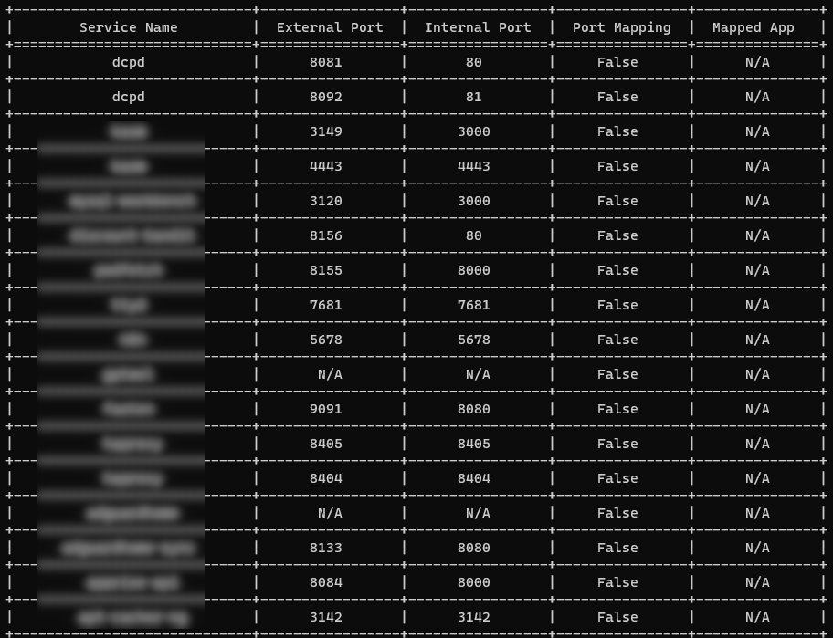
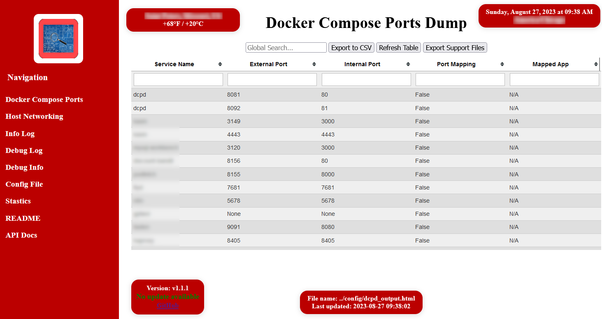

# Table of Contents
- [Summary](#summary)
- [Features](#features)
- [Current Known Issues](#current-known-issues)
- [Installation](#installation)
- [Local Usage Instructions](#local-usage-instructions)
- [To DO](#to-do)
- [Security Vulnerabilities](#security-vulnerabilities)
- [License](#license)
- [Acknowledgements](#acknowledgements)

# **Summary**
This script parses a docker-compose.yml file(s) and dumps all assigned ports into a table and displays them in either the terminal or in a web page.  It defaults to sort by the order services are defined in docker-compose.yml.  It also has options to sort by external ports or by container names.  If you have containers that are attached to a VPN container, you can also have those mapped as well.


The script does not change the existing file and only needs read access to your docker-compose.yml file.

This was developed on Ubuntu 22.04 running Python 3.10.6.  Use at your own risk.  This comes with no warranty or guarantees.

# **Features**

[Table of Contents](#table-of-contents)

* Collect and display the following either in the terminal or on a web page
	* All external and internal port definitions for services in docker-compose.yml
	* Ports mapped to a VPN container
* Additionally display the following on the web page
	* Containers attached to host networking
	* info and debug logs
	* docker inspect, ps, and stats info
	* dcpd debug information
	* dcpd configuration file
	* dcpd statistics page
* Export of all data from the web page
* Export all support files into redacted and password protected zip file
* Supports one or more docker-compose files

# **Current Known Issues**

[Table of Contents](#table-of-contents)

* Global search and column filters - Searching external and internal port for 80 will return 80 and 7801 as expected.  However, it will also return 8405.
* Does not work behind an https proxy

# **Installation**

[Table of Contents](#table-of-contents)

## **Docker**

### Run this command to generate your own random API_KEY

```
cat /dev/urandom | tr -dc 'a-zA-Z0-9' | head -c 24 ; echo
```

### Accepted values for DEFAULT_WEB_PAGE variables can be found in dcpd_config_example.py

### **Docker Compose**
```
services:
  dcpd:
    hostname: dcpd
    image: ghcr.io/samcro1967/docker_compose_ports_dump:latest
    container_name: dcpd
    environment:
      - TZ=your_time_zone
      - PUID=1000
      - PGID=1000
      - CRON_SCHEDULE=*/15 * * * *
      - DOCKER_COMPOSE_FILE_PATHS="/compose-files/docker-compose.yml,/app/compose-files/docker-compose_test.yml"
      - DEFAULT_VPN_CONTAINER_NAME=your_vpn_container_name
      - REDACTED_ZIP_FILE_PASSWORD=your_redacted_file_password
      - API_KEY=your_random_api_key
      - API_PORT=51763 # Optional, To override the default
      - BASIC_AUTH_USER=your_user_name
      - BASIC_AUTH_PASS=your_user_password
      - DEFAULT_WEB_PAGE_BACKGROUND_COLOR=scarlet #Optional
      - DEFAULT_WEB_PAGE_ACCENT_COLOR=gray #Optional
      - DEFAULT_WEB_PAGE_TEXT_COLOR=white #Optional
      - DEFAULT_WEB_PAGE_FONT_NAME=roboto #Optional
      - DEFAULT_WEB_PAGE_FONT_SIZE=medium #Optional
    ports:
      - "8080:8080"
      - "51763:51763" # External and Internal ports must be the same and match API_PORT if set
    volumes:
      # root of folder where all docker compose folder reside
      - /path/to/compose/files:/compose-files
      - /var/run/docker.sock:/var/run/docker.sock:ro
    healthcheck:
      test: /app/healthcheck.sh
      interval: 60s
      timeout: 10s
      retries: 3
      start_period: 10s
```
### **Docker Run**
```
docker run \
  --hostname dcpd \
  --name dcpd \
  -e TZ=your_time_zone \
  -e PUID=1000 \
  -e PGID=1000 \
  -e CRON_SCHEDULE=*/15 * * * *
  -e DOCKER_COMPOSE_FILE_PATHS="/compose-files/docker-compose.yml,/app/compose-files/docker-compose_test.yml"
  -e DEFAULT_VPN_CONTAINER_NAME=your_vpn_container_name
  -e REDACTED_ZIP_FILE_PASSWORD=your_redacted_file_password
  -e API_KEY=your_random_api_key
  -e API_PORT=51763 # Optional, To override the default
  -e BASIC_AUTH_USER=your_user_name
  -e BASIC_AUTH_PASS=your_user_password
  -e DEFAULT_WEB_PAGE_BACKGROUND_COLOR=scarlet #Optional
  -e DEFAULT_WEB_PAGE_ACCENT_COLOR=gray #Optional
  -e DEFAULT_WEB_PAGE_TEXT_COLOR=white #Optional
  -e DEFAULT_WEB_PAGE_FONT_NAME=roboto #Optional
  -e DEFAULT_WEB_PAGE_FONT_SIZE=medium #Optional
  -p 8080:8080 \
  -p 51763:51763 \
  -v /path/to/compose/files:/compose-files \
  -v /var/run/docker.sock:/var/run/docker.sock:ro \
  --health-cmd="/app/healthcheck.sh" \
  --health-interval=60s \
  --health-timeout=10s \
  --health-retries=3 \
  --health-start-period=10s \
  ghcr.io/samcro1967/docker_compose_ports_dump:latest
```
Launch your browser and go to http://ipaddress:80/dcpd
```
If you did not change the user name and password, here are the defaults:
Default user name: dcpd_admin
Default user password: P@55w0rd
```

# **Local Usage Instructions**

[Table of Contents](#table-of-contents)

## **For help:**

docker exec -it dcpd bash -c 'cd /app/src && ./dcpd.py -h'

[help.md](./docs/help.md)

## **port.mapping(s) example config**

docker exec -it dcpd bash -c 'cd /app/src && ./dcpd.py -s'

[examples.md](./docs/examples.md)

## **Terminal output example:**

docker exec -it dcpd bash -c 'cd /app/src && ./dcpd.py'



## **Web Page Output Example:** 

docker exec -it dcpd bash -c 'cd /app/src && ./dcpd.py -o'

Launch your browser and go to http://ipaddress:80/dcpd
```
Default user name: dcpd_admin
Default user password: P@55w0rd
```


## Additional screen shots
[View screenshots](./docs/)

# **To Do**

[Table of Contents](#table-of-contents)

- ✅ Support multiple docker-compose.yml files.
- ❌ Auto scan a directory and subdirectories for docker-compose.yml files.
- ❌ Native https support.
- ✅ Security vulnerability scans with trivy and codeql
- ✅ Code and performance improvements with pylint and cProfile/snakeviz
- 🔲 Investigate arm64 image.
- 🔲 Investigate supporting behind an https proxy.

Legend
- ✅ This task is complete.
- ❌ This task is not being pursued.
- 🔲 This task is yet to be done.
- 🔜 This task is in progress.

## **Security Vulnerabilities**

[Table of Contents](#table-of-contents)

There are no known security vulnerabilities in the image as of 9/2/2023.

```
docker run --rm -v /var/run/docker.sock:/var/run/docker.sock -v $HOME/Library/Caches:/root/.cache/ aquasec/trivy image ghcr.io/samcro1967/docker-compose-ports-dump:latest

2023-09-02T13:38:06.848Z        INFO    Vulnerability scanning is enabled
2023-09-02T13:38:06.848Z        INFO    Secret scanning is enabled
2023-09-02T13:38:06.848Z        INFO    If your scanning is slow, please try '--scanners vuln' to disable secret scanning
2023-09-02T13:38:06.848Z        INFO    Please see also https://aquasecurity.github.io/trivy/v0.45/docs/scanner/secret/#recommendation for faster secret detection
2023-09-02T13:38:11.825Z        INFO    Detected OS: alpine
2023-09-02T13:38:11.825Z        INFO    Detecting Alpine vulnerabilities...
2023-09-02T13:38:11.828Z        INFO    Number of language-specific files: 3
2023-09-02T13:38:11.828Z        INFO    Detecting gobinary vulnerabilities...
2023-09-02T13:38:11.833Z        INFO    Detecting python-pkg vulnerabilities...

ghcr.io/samcro1967/docker-compose-ports-dump:latest (alpine 3.18.3)
=============================================================================
Total: 0 (UNKNOWN: 0, LOW: 0, MEDIUM: 0, HIGH: 0, CRITICAL: 0)
```


# **License**

[Table of Contents](#table-of-contents)

This project is licensed under the terms of the MIT license. See the [LICENSE](LICENSE) file for details.

# **Acknowledgements**

[Table of Contents](#table-of-contents)

This project makes use of the following third-party software:

- **Caddy**: An open-source web server with automatic HTTPS. Licensed under the [Apache 2.0 License](https://www.apache.org/licenses/LICENSE-2.0). More information can be found at the [Caddy Official Website](https://caddyserver.com/) or the [Caddy GitHub Repository](https://github.com/caddyserver/caddy).

- **jQuery**: A fast, small, and feature-rich JavaScript library. Licensed under the [MIT License](https://opensource.org/licenses/MIT). More information and source code can be found on the [jQuery Official Website](https://jquery.com/).

- **jquery.tablesorter**: A jQuery plugin for turning a standard HTML table with THEAD and TBODY tags into a sortable table without refreshing the page. Licensed under the [MIT License](https://opensource.org/licenses/MIT). More details and source code are available at the [jquery.tablesorter GitHub Repository](https://mottie.github.io/tablesorter/docs/).

- **delete-untagged-ghcr-action**: This action deletes untagged images from the GitHub Container Registry. Used under [MIT License](https://github.com/Chizkiyahu/delete-untagged-ghcr-action/blob/main/LICENSE) (link to the license might change based on the repository structure). More details and source code are available at the [delete-untagged-ghcr-action GitHub Repository](https://github.com/Chizkiyahu/delete-untagged-ghcr-action).
